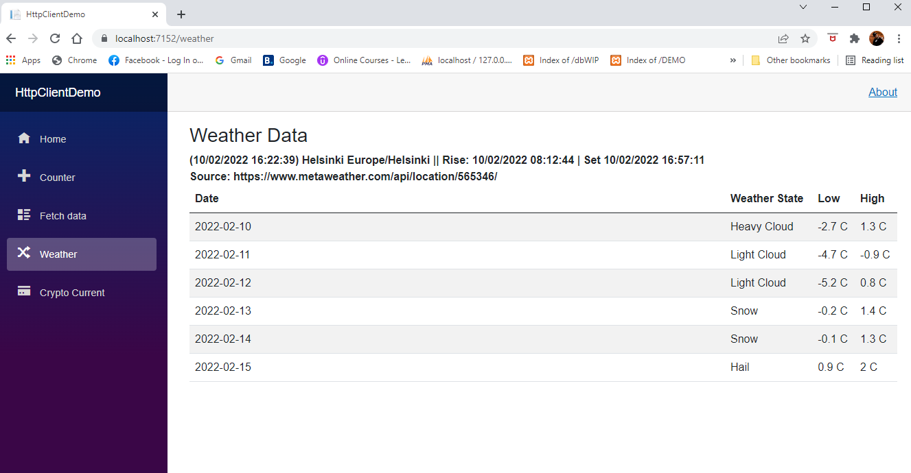
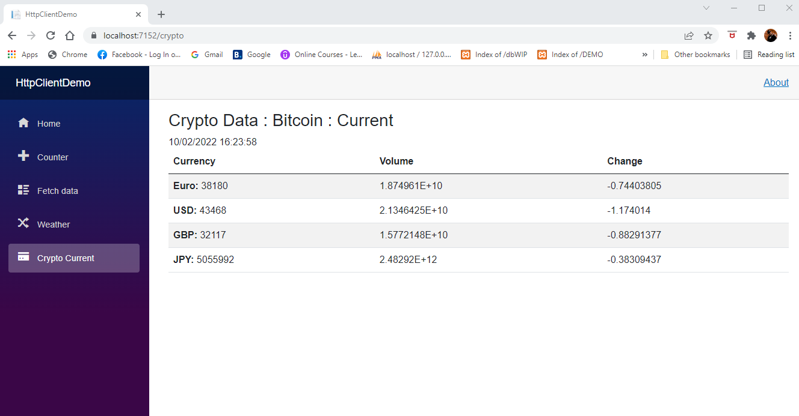

# HttpClientDemoApp
Demo Hub for different coding experiments: HttpClientDemo

C#/ASP.NET MVC Razor pages

HttpClient REST API for 2 different calls. 
- 5 days weatherforecast (weather state, daily low/high degrees) for Helsinki, Finland from https://www.metaweather.com/api/location/565346/
- Current Bitcoin value (Euro, USD, GBP and JPY) currencies with 24 hours volume and change from https://api.coingecko.com/api/

